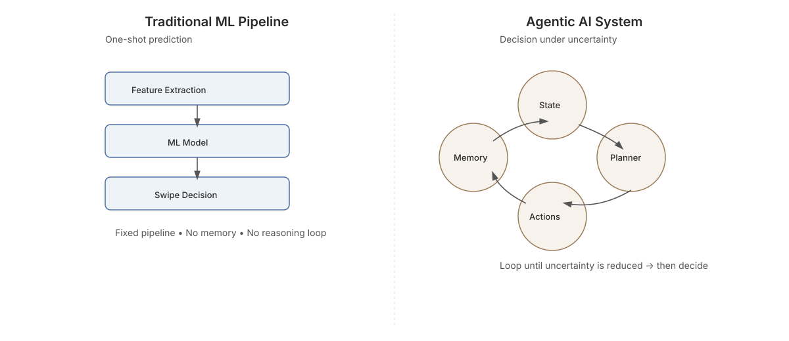

# Swipe Left or Right on Bumble? — ML vs Agentic AI



> **Machine Learning predicts attraction.  
> Agentic AI decides under uncertainty.**

**Tags:** `agentic-ai` · `ai-agents` · `machine-learning` · `decision-making` · `llm-agents` · `software-architecture`

---

## 🚀 Overview

This repository is a **fully worked, architecture-first reference implementation** that demonstrates the difference between:

- **Traditional Machine Learning pipelines**
- **Modern Agentic AI systems**

using a concrete, relatable real-world problem:

> **Should I swipe LEFT or RIGHT on a dating profile?**

This is **not** a chatbot.  
This is **not** a recommender model.

It is a **decision-making AI system** that reasons under uncertainty using:
- explicit state
- iterative reasoning loops
- memory and reflection
- safety and bias constraints
- optional LangGraph-based execution

---

## 🔍 Why This Project Exists

Most ML systems are optimized for **prediction accuracy**.

Most real-world decisions are:
- subjective
- high-uncertainty
- context-dependent
- costly when wrong
- explanation-sensitive

Dating is a perfect example.

Traditional ML asks:
> *“What usually happened in the past?”*

Agentic AI asks:
> **“Given what I know and what I don’t, what should I do next?”**

That single shift changes the entire architecture.

---

## 🧠 ML Pipeline vs Agentic AI (At a Glance)

### Traditional ML Pipeline
- One-shot prediction
- Fixed control flow
- Implicit uncertainty
- Offline learning (retraining)
- Weak explainability

```
Profile → Feature Engineering → Model → Swipe
```

---

### Agentic AI System
- Iterative reasoning loop
- Explicit unknowns
- Investigative actions
- Memory + reflection
- Decision only when justified

```
State → Plan → Act → Observe → Update → Decide?
```

---

## 🏗️ Agent Architecture

The agent is built from **first principles**, not frameworks.

### Core Components
- **Goal** — what success means
- **State** — known facts, unknowns, decision
- **Planner** — selects the *next action* (LLM-assisted)
- **Actions** — reduce uncertainty
- **Memory**
  - short-term (current reasoning)
  - long-term (vector memory)
- **Decision** — terminal commitment
- **Reflection** — learning without retraining
- **Safety** — ethical constraints enforced by design

See 👉 [`docs/architecture.md`](docs/architecture.md) for a step-by-step architectural evolution.

---

## 📁 Repository Structure

```
dating-agent/
├── agent/
│   ├── core.py              # Pure Python agent loop (source of truth)
│   ├── langgraph_agent.py   # LangGraph implementation (same logic)
│   ├── planner.py           # Planner abstraction
│   ├── actions.py           # Investigative actions
│   ├── memory.py            # Short-term + vector memory
│   ├── reflection.py        # Post-decision learning
│   └── safety.py            # Ethical & bias constraints
│
├── examples/
│   └── demo.py              # One-command demo
│
├── tests/
│   └── test_invariants.py   # Architectural invariants
│
├── docs/
│   ├── architecture.md
│   └── agentic-vs-ml.svg
│
├── README.md
├── CONTRIBUTING.md
├── LICENSE
├── requirements.txt
└── .github/workflows/tests.yml
```

---

## ▶️ Run the Demo

```bash
pip install -r requirements.txt
python examples/demo.py
```

This will:
- execute the full agentic loop
- print the final decision (LEFT / RIGHT)
- show the agent’s internal memory trace

---

## 🔁 LangGraph Support (Side-by-Side)

This project intentionally includes **two equivalent implementations**:

1. **Pure Python agent loop**
   - explicit
   - educational
   - debuggable

2. **LangGraph-based agent**
   - production-style
   - graph-structured control flow
   - same mental model

LangGraph **formalizes the loop** — it does not replace it.

---

## 🧪 Testing Philosophy

Tests focus on **architectural invariants**, not outputs:

- The agent must not decide while unknowns remain
- A decision must be terminal
- Safety constraints must always be respected

This reflects the reality of **non-deterministic LLM systems**.

---

## 🛡️ Safety & Bias

Safety is enforced **architecturally**, not post-hoc:

- No judgments based on protected attributes
- No personality inference from appearance alone
- Decisions grounded only in stated preferences and observations

Safety constraints override:
- planner suggestions
- memory recall
- past experience

---

## 📜 License

MIT License — free to use, modify, and learn from.

---

## 👥 Who This Is For

- ML engineers exploring agentic systems
- Software engineers moving from pipelines → systems
- Researchers studying decision-making under uncertainty
- Practitioners building LLM-based agents responsibly

---

## ⭐ Final Takeaway

If this sentence feels obvious, the shift is complete:

> **Machine Learning predicts outcomes.  
> Agentic AI decides under uncertainty, values, and ethics.**

This repository exists to make that difference concrete.
